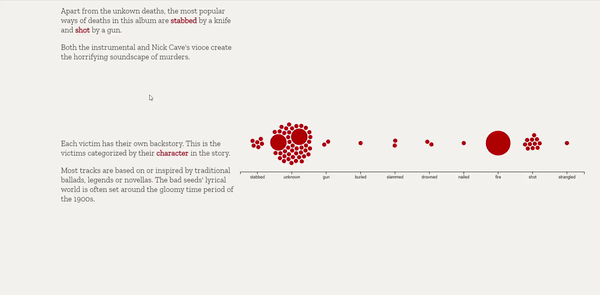

Quantifying Lyrics of Nick Cave & the Bad seeds

[link to webpage](https://qp274.github.io/cdv/projects/nickcave/)

 
If you don't know my favourite band now you know. Nick Cave & the Bad Seeds, what do they do in their lyrics except murder?

methodology for data:
scraping: python package LyricsGenius
sentiment analysis: python package afinn
other: write word processing code on python

I chose to visualize the data in a way that shows the progression of lyrics throughout their discograohy timeline.
crucial compromises: I did not get to fully utilize the data i scraped and only show a few kyewords in the second visualization.
I'd like to continuously work on this page and include more data.
